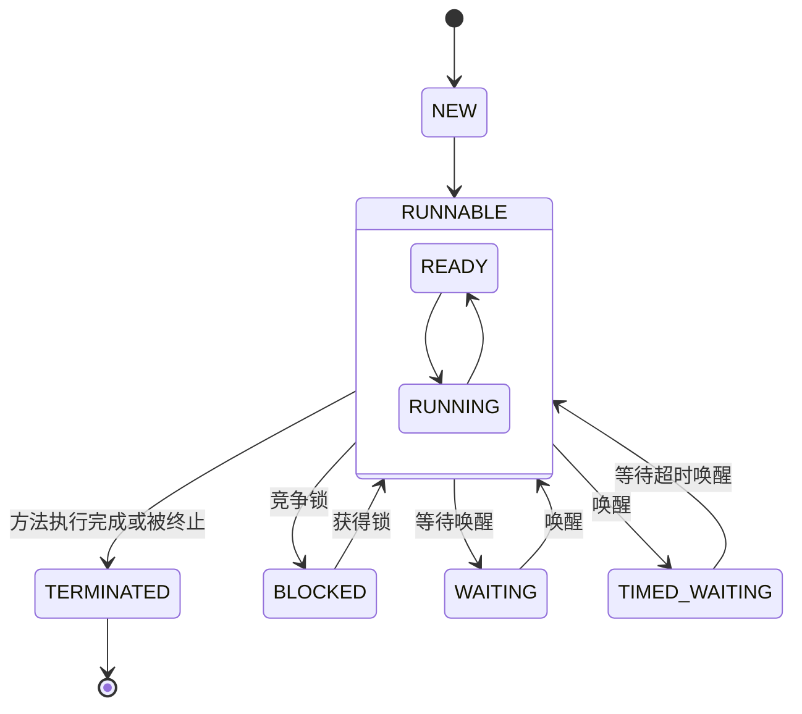

## Thread

### Thread 状态

* NEW

  线程尚未被执行。调用start()方法后线程进入RUNNABLE状态。

* RUNNABLE

  线程获取到锁处于可运行状态，又分为READY和RUNNING两个状态，这取决于处理器等对线程的调度。

* BLOCKED

  线程阻塞等待获取锁。已获取锁的线程阻塞在其他锁上不会释放已有锁。

* WAITING

  线程执行以下方法后会进行等待状态：

  * Object.wait()
  * Thread.join()
  * LockSupport.park()

  处于WAITING状态的线程需要满足特定的条件才会被唤醒重新进入RUNNABLE状态，如持有锁的线程调用Object.notify或Object.notifAll方法，通过Thread.join进入WAITING状态的则是被join线程完成后唤醒。

* TIMED_WAITING

  线程执行以下方法会进入定时等待状态：

  * Thread.sleep()
  * Object.wait()
  * Thread.join()
  * LockSupport.parkNanos()
  * LockSupport.parkUntil()

  处于TIMED_WAITING状态的线程在超时后会自动进入RUNNABLE状态。如果是调用Thread.sleep方法线程不会释放锁。

* TERMINATED

  线程执行完毕或遇到未捕获异常时会进入TERMINATED状态。

当调用线程的interrupt方法时不会改变线程的状态，而是会将中断标志位设为true。当线程等待在Thread.sleep()和Object.wait()的方法上时会抛出InterruptedException，如果线程正在正常运行则需要线程自己去检查中断标志位是否被中断并做出相应的处理。

## synchronized

### 锁升级

synchronized锁可以升级不可以降级，引入锁升级可以降低锁竞争的开销，重量级锁需要在内核态和用户态之间竞争。

